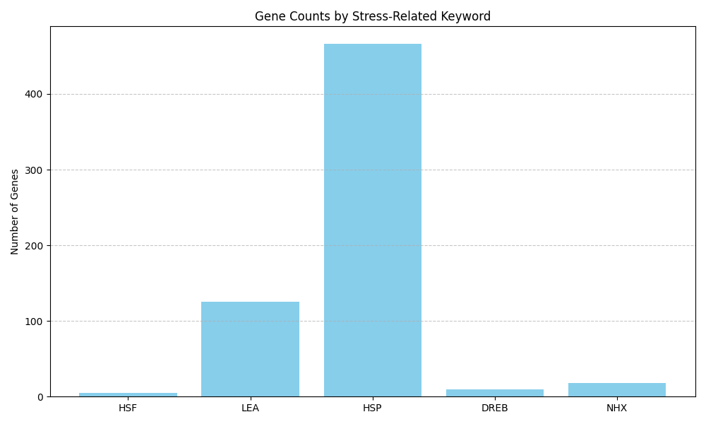
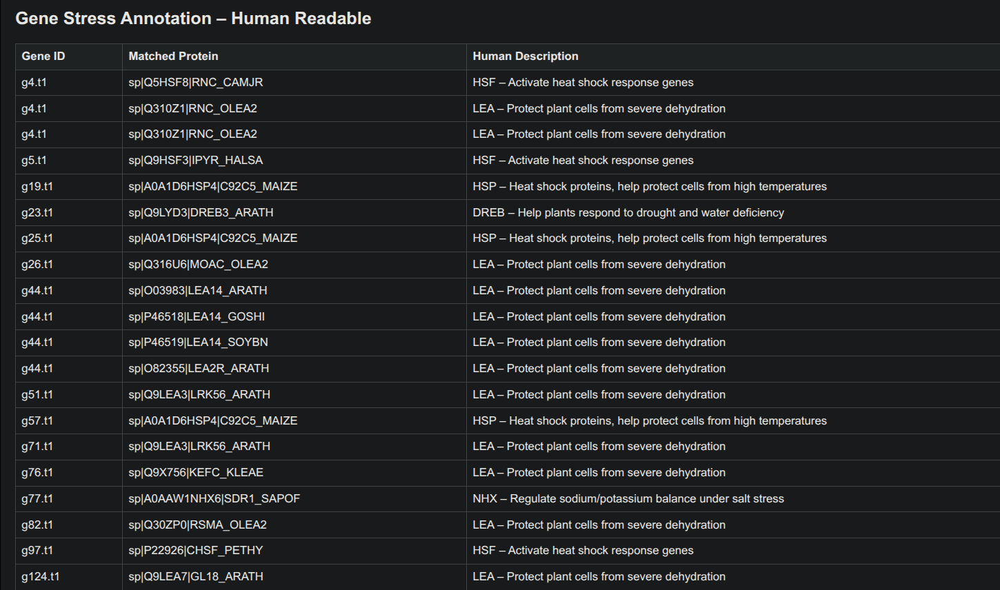

# Genome-Annotation-and-Functional-Gene-Analysis

## Overview

**Mining of Abiotic-Resistance Genes in Extremely Phytotolerant Plant Genomes**

This pipeline enables automated genome annotation and functional gene analysis with a focus on discovering abiotic stress-resistance genes in highly tolerant plant species. It streamlines gene prediction, sequence extraction, protein annotation, and stress-related gene filtering, producing comprehensive summary tables and visualizations for downstream research.


## Screenshot





*Example output visualization generated by the pipeline.*

## Features

- **FASTA validation**: Checks input genome FASTA files for format and base correctness.
- **Gene prediction**: Uses Augustus for ab initio gene prediction.
- **CDS/protein extraction**: Extracts coding and protein sequences using GFFread.
- **Protein annotation**: Annotates predicted proteins via BLAST against UniProt.
- **Stress gene filtering**: Filters BLAST results for stress-related proteins (e.g., HSP, DREB, LEA).
- **Summary generation**: Outputs CSV and HTML summaries of stress-related genes.
- **Visualization**: Plots bar graphs of gene counts by stress type.

## Pipeline Logic

1. **Validate Genome File**  
    Ensure the input FASTA file is correctly formatted and contains high-quality sequence data.

2. **Gene Boundary Detection**  
    Use gene prediction tools to identify the start and end positions of each gene within the genome.

3. **Gene Expression Simulation**  
    Extract each gene’s DNA sequence and translate it into its corresponding protein sequence.

4. **Protein Function Prediction**  
    Annotate predicted proteins by comparing them to known proteins (e.g., HSPs) using BLAST.

5. **Stress-Related Protein Filtering**  
    Filter annotated proteins to retain only those associated with stress resistance.

6. **Summary Table Generation**  
    Compile filtered results into a structured summary table for downstream analysis and visualization.


## Requirements

- Python 3
- Biopython
- matplotlib
- Augustus (gene prediction tool)
- GFFread (sequence extraction)
- BLAST+ (protein annotation)
- UniProt Swiss-Prot BLAST database

Install Python dependencies:
```bash
pip install biopython matplotlib
```

## Usage

```bash
python3 genome_annotation.py <genome.fasta>
```

**Input:**  
- `<genome.fasta>`: Genome sequence in FASTA format.

**Output files:**  
- `<genome>.gff3`: Predicted gene annotations.
- `<genome>.cds.fasta`: Coding sequences.
- `<genome>.proteins.fasta`: Protein sequences.
- `<genome>_blast_results.tsv`: BLAST annotation results.
- `<genome>_filtered_stress.tsv`: Filtered stress-related proteins.
- `<genome>_stress_summary.csv`: CSV summary of stress genes.
- `<genome>.stress_genes.png`: Bar graph of stress gene counts.
- `<genome>.html`: Human-readable HTML summary.

## Stress-Related Keywords

The pipeline identifies genes related to the following stress types:
- HSP (Heat shock proteins)
- DREB (Drought response)
- LEA (Dehydration protection)
- HSF (Heat shock factors)
- SOS (Salt tolerance)
- NHX (Ion balance under salt stress)
- RD29 (Drought/salinity stress)
- AREB (ABA hormone response)

## Example

```bash
python3 genome_annotation.py arabidopsis.fasta
```

## Notes

- Ensure Augustus, GFFread, and BLAST+ are installed and available in your PATH.
- Download and format the UniProt Swiss-Prot database for BLAST.

## License

This project is provided under the MIT License.